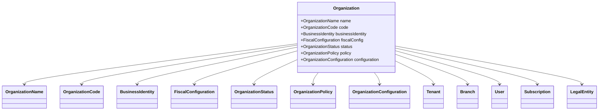
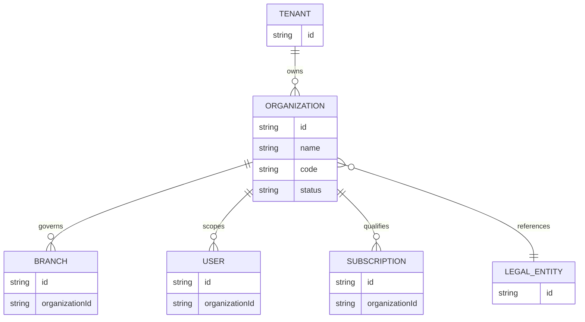
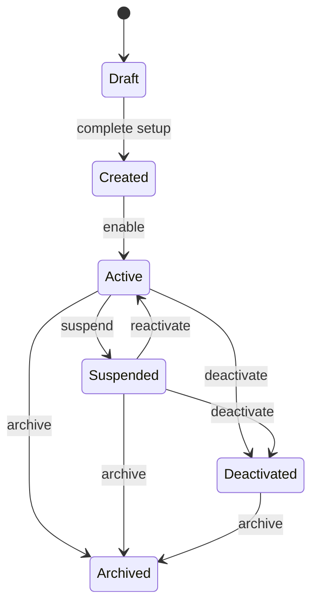
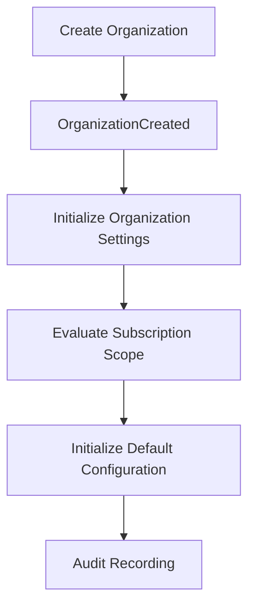
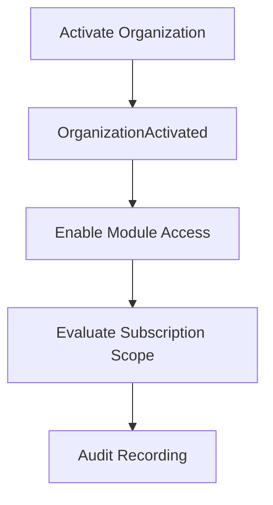
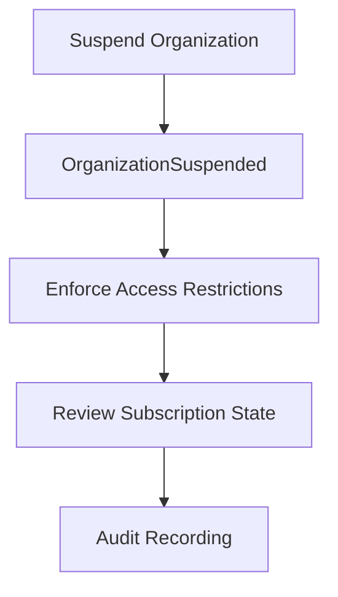
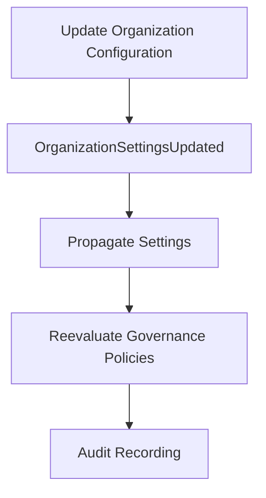
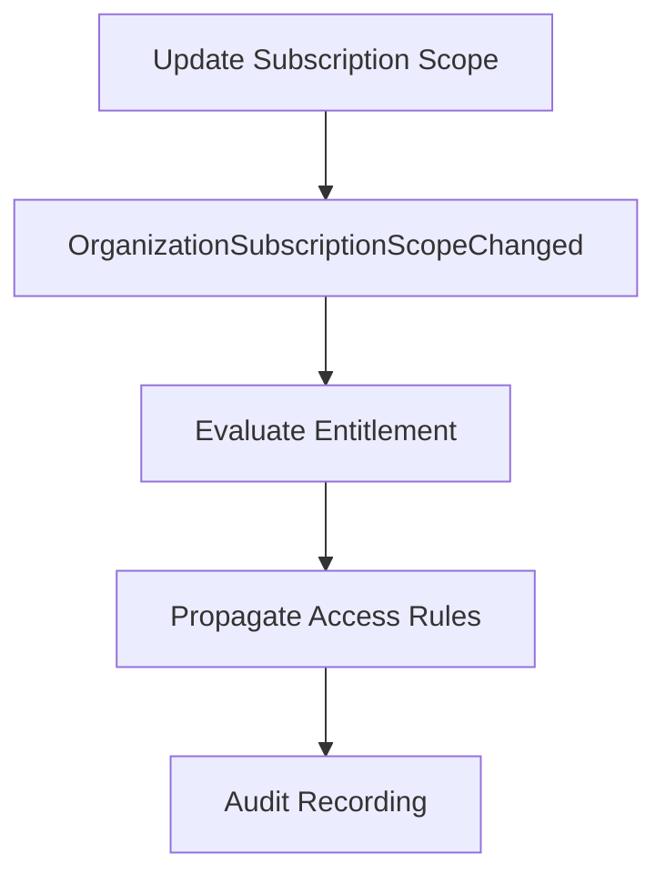

# Organization Domain Model

## 1. Domain Model Overview

The Organization Domain Model defines the business representation of an organization within MEMO PLATFORM. It describes the aggregate root, owned value objects, policies, configuration, and relationships that define the organization as a bounded context for enterprise operations.

Organization is the Aggregate Root because it is the primary consistency boundary for organization-level identity, governance, and lifecycle state. It encapsulates the business rules that ensure organizations behave correctly and consistently as a unit. The model prevents external domains from mutating organization state directly, and defines clear boundaries for what belongs inside versus outside the aggregate.

Aggregate consistency boundaries are established around the Organization and its closely related concepts. Inside the aggregate, invariants are strongly enforced and transactions are atomic. Outside the aggregate, related domains such as Branch, User, Tenant, and Legal Entity are referenced by contract and coordinated through domain events.

---

## 2. Aggregate Structure

Organization (Aggregate Root)

Owned Value Objects
- OrganizationName
- OrganizationCode
- BusinessIdentity
- FiscalConfiguration
- OrganizationStatus

Owned Policies
- OrganizationPolicy

Owned Configuration
- OrganizationConfiguration

Referenced Aggregates
- Tenant
- Branch
- User
- Subscription
- Legal Entity

---

## 3. Entity Model

### Organization
- Purpose
  - Represent the business entity that drives organization-level identity, governance, and lifecycle within the ERP platform.
- Identity
  - Defined by immutable organization identifiers and a unique organization code within Tenant scope.
- Lifecycle
  - Created, Active, Suspended, Deactivated, Archived.
- Owner
  - Owned by the Organization aggregate itself.
- Responsibilities
  - Maintain organization metadata, lifecycle state, governance profile, and configuration defaults.
  - Validate organization invariants before changes are committed.
- Invariants
  - Must belong to exactly one Tenant.
  - Must maintain immutable identifiers.
  - Must enforce approved lifecycle transitions.
- Relationships
  - References Tenant for platform account context.
  - References Branches as subordinate operational units.
  - References Legal Entities for statutory compliance.
  - References Subscriptions for module eligibility and entitlements.

### Tenant
- Purpose
  - Represent the platform account and subscription boundary under which Organizations are created.
- Identity
  - Defined by tenant account identifiers and registration metadata.
- Lifecycle
  - Tenant lifecycle is managed outside the Organization Domain but influences organization context.
- Owner
  - Owned by the Tenant Domain.
- Responsibilities
  - Provide platform account context and tenant-level boundaries.
- Invariants
  - Must remain separate from organization lifecycle state.
- Relationships
  - Organization belongs to exactly one Tenant.

### Branch
- Purpose
  - Represent an operational location or business unit under an Organization.
- Identity
  - Defined by branch identifiers and branch code.
- Lifecycle
  - Managed by the Branch Domain, but lifecycle depends on organization status.
- Owner
  - Owned by the Branch Domain.
- Responsibilities
  - Execute local business activity and enforce branch-level rules.
- Invariants
  - Must belong to exactly one Organization.
- Relationships
  - References Organization for governance and configuration defaults.

### User
- Purpose
  - Represent individuals who operate within the organization context.
- Identity
  - Defined by user identifiers and tenant-scoped credentials.
- Lifecycle
  - Managed by the User Domain; user assignment depends on organization existence.
- Owner
  - Owned by the User Domain.
- Responsibilities
  - Provide access and identity for organization activities.
- Invariants
  - Must not be managed directly by the Organization aggregate.
- Relationships
  - References Organization for context and authorization scope.

### Subscription
- Purpose
  - Represent the entitlement and access level associated with an Organization.
- Identity
  - Defined by subscription identifiers and plan metadata.
- Lifecycle
  - Managed by the Subscription Domain.
- Owner
  - Owned by the Subscription Domain.
- Responsibilities
  - Determine module eligibility and billing scope.
- Invariants
  - Must be evaluated in relation to organization lifecycle.
- Relationships
  - References Organization for eligibility decisions.

### Legal Entity
- Purpose
  - Represent statutory registration and tax identity associated with an Organization.
- Identity
  - Defined by legal identifier values and jurisdiction metadata.
- Lifecycle
  - Managed by the Legal Entity Domain.
- Owner
  - Owned by the Legal Entity Domain.
- Responsibilities
  - Provide compliance context and legal association.
- Invariants
  - May be associated with zero, one, or many Organizations.
- Relationships
  - Referenced by Organization for regulatory and reporting context.

---

## 4. Value Objects

### OrganizationName
- Purpose
  - Encapsulate the official business name of the Organization.
- Fields
  - name
- Validation
  - Must be present.
  - Must be unique within Tenant scope.
  - Must conform to naming constraints.
- Immutability
  - Immutable after creation.
- Equality
  - Instances are equal when all immutable fields are equal.
- Examples
  - "Acme Retail Group"
  - "Northbridge Logistics"

### OrganizationCode
- Purpose
  - Provide a stable reference code for the Organization.
- Fields
  - code
- Validation
  - Must be present.
  - Must be unique within Tenant scope.
  - Must follow organizational code format.
- Immutability
  - Immutable after creation.
- Equality
  - Instances are equal when all immutable fields are equal.
- Examples
  - "ORG-1001"
  - "ACME-001"

### BusinessIdentity
- Purpose
  - Represent legal and commercial identifiers for the Organization.
- Fields
  - identifierValue
  - identifierType
- Validation
  - Must contain valid identifier type.
  - Must conform to jurisdiction rules when provided.
- Immutability
  - Immutable after creation.
- Equality
  - Instances are equal when all immutable fields are equal.
- Examples
  - Tax ID, VAT number, registration number

### FiscalConfiguration
- Purpose
  - Capture financial defaults for the Organization.
- Fields
  - baseCurrency
  - fiscalYearDefinition
  - taxJurisdiction
- Validation
  - Must specify a base currency before activation.
  - Must define fiscal periods if financial processing is enabled.
- Immutability
  - Immutable after creation unless replaced through a new configuration.
- Equality
  - Instances are equal when all immutable fields are equal.
- Examples
  - USD base currency, calendar year fiscal year, tax jurisdiction code

### OrganizationStatus
- Purpose
  - Represent the Organization lifecycle state.
- Fields
  - statusCode
- Validation
  - Must be one of the approved lifecycle states.
  - Must follow lifecycle transition rules.
- Immutability
  - Immutable once set for a given state instance.
- Equality
  - Instances are equal when all immutable fields are equal.
- Examples
  - Draft, Created, Active, Suspended, Archived

---

## 5. Aggregate Boundaries

### Inside Aggregate
- Organization
- OrganizationStatus
- OrganizationPolicy
- OrganizationConfiguration
- Value objects that support organization identity and lifecycle

### Outside Aggregate
- Branch
- User
- Subscription
- Legal Entity
- Tenant

### Reference Rules
- The Organization aggregate may reference external domain concepts by identity or contract.
- External aggregates may reference Organization through published events and domain contracts.

### Ownership Rules
- Organization owns organization-level metadata and lifecycle.
- Branch, User, Subscription, and Legal Entity are owned by their respective domains.

### Modification Rules
- Only the Organization aggregate root may modify aggregate state directly.
- External domains must influence Organization through domain events and bounded contracts.

### Transaction Boundary
- The Organization aggregate defines the transaction boundary for organization-level changes.
- All internal invariants must be satisfied within a single transaction.

---

## 6. Relationships

### Tenant
- Relationship Type
  - Parent context
- Ownership
  - Tenant owns the account boundary.
- Cardinality
  - One Tenant to many Organizations.
- Dependency Direction
  - Organization depends on Tenant for platform context.
- Communication Pattern
  - Tenant provides context to Organization; Organization emits lifecycle events for tenant services.
- Consistency Rule
  - Tenant isolation is enforced; Organization belongs to exactly one Tenant.

### Branch
- Relationship Type
  - Subordinate operational unit
- Ownership
  - Branch is owned by the Branch Domain.
- Cardinality
  - One Organization to many Branches.
- Dependency Direction
  - Branch depends on Organization for governance and defaults.
- Communication Pattern
  - Organization publishes configuration and lifecycle events; Branch consumes them.
- Consistency Rule
  - Branch creation requires an existing Organization.

### User
- Relationship Type
  - Contextual association
- Ownership
  - User domain owns identity.
- Cardinality
  - One Organization to many Users.
- Dependency Direction
  - User depends on Organization for tenant scope.
- Communication Pattern
  - Organization lifecycle events inform user access and authorization.
- Consistency Rule
  - Users are assigned only after Organization existence is confirmed.

### Subscription
- Relationship Type
  - Entitlement association
- Ownership
  - Subscription domain owns billing and entitlement.
- Cardinality
  - One Organization to one or more Subscription plans or entitlements.
- Dependency Direction
  - Subscription depends on Organization for eligibility context.
- Communication Pattern
  - Organization events trigger subscription evaluation.
- Consistency Rule
  - Organization lifecycle affects subscription availability.

### Settings
- Relationship Type
  - Configuration reference
- Ownership
  - Settings domain owns storage.
- Cardinality
  - One Organization to many settings scopes.
- Dependency Direction
  - Settings depend on Organization for defaults.
- Communication Pattern
  - Organization publishes defaults and settings updates.
- Consistency Rule
  - Organization settings updates must be propagated consistently.

### Audit
- Relationship Type
  - Event capture
- Ownership
  - Audit domain owns retention and storage.
- Cardinality
  - One Organization to many audit entries.
- Dependency Direction
  - Audit depends on Organization for business context.
- Communication Pattern
  - Organization emits events that audit consumes.
- Consistency Rule
  - Audit must record organization event context immutably.

### Legal Entity
- Relationship Type
  - Compliance association
- Ownership
  - Legal Entity domain owns statutory data.
- Cardinality
  - One Organization to zero, one, or many Legal Entities.
- Dependency Direction
  - Organization depends on Legal Entity associations for compliance.
- Communication Pattern
  - Organization references legal entity associations; legal entities may receive organization linkage events.
- Consistency Rule
  - Organization/legal entity associations must respect business requirements.

---

## 7. Lifecycle State Machine

Organization lifecycle states define operational readiness and scope.

States:
- Draft
- Created
- Active
- Suspended
- Deactivated
- Archived

Allowed transitions:
- Draft -> Created
- Created -> Active
- Active -> Suspended
- Suspended -> Active
- Active -> Deactivated
- Suspended -> Deactivated
- Active -> Archived
- Suspended -> Archived
- Deactivated -> Archived

Invalid transitions:
- Draft -> Active
- Archived -> Active
- Active -> Draft

State rules:
- Draft is a temporary pre-creation state for incomplete organization definitions.
- Created means the organization exists and is configured but not yet operational.
- Active means the organization is fully enabled for business modules.
- Suspended means the organization is temporarily prevented from operational activity.
- Deactivated means the organization is non-operational but retained for administrative review or archival preparation.
- Archived means the organization is retired from active use but preserved for historical purposes.

---

## 8. Aggregate Consistency Rules
- Organization must enforce unique identity within the Tenant boundary.
- Organization must enforce immutable identifiers.
- Organization must enforce approved lifecycle transitions.
- Organization must validate governance configuration before activation.
- Organization must ensure organization-level defaults are consistent across the aggregate.
- Organization must prevent external domains from mutating its internal state directly.

---

## 9. Domain Constraints
- Immutable Identifiers
  - Organization identifiers cannot change once assigned.
- Tenant Isolation
  - Organization belongs to exactly one Tenant and cannot span multiple tenants.
- Aggregate Ownership
  - Organization owns organization-level metadata and lifecycle state.
- Cross Aggregate References
  - Organization references Branch, User, Subscription, and Legal Entity by contract, never by direct ownership.
- No distributed transactions
  - Consistency across domains is achieved via domain events, not cross-aggregate transactions.

---

## 10. Domain Navigation Rules
- Allowed
  - Other domains may navigate toward Organization through published identity references, domain events, and defined contracts.
  - Dependent domains may query Organization context when needed for governance or scope decisions.
- Forbidden
  - Other domains must not modify Organization state directly.
  - Other domains must not traverse the Organization aggregate to access internal value objects or policies.
  - No direct database navigation into the Organization aggregate from external domains.

---

## Visual Models

### Class Diagram

### ER Diagram

### State Diagram

---

## Domain Responsibilities Matrix

| Concern | Owner Domain |
|----------|--------------|
| Organization Identity | Organization |
| Organization Lifecycle | Organization |
| Governance | Organization |
| Organization Configuration | Organization |
| Branch Operations | Branch |
| User Identity | User |
| Authentication | Authorization / Identity |
| Subscription Billing | Subscription |
| Legal Registration | Legal Entity |
| Audit Logging | Audit |
| Settings Storage | Settings |

---

## Use Case Mapping

### Create Organization
- Purpose
  - Establish a new organization within the tenant boundary.
- Primary Actor
  - Tenant administrator.
- Preconditions
  - Tenant context exists.
  - Organization identity values are validated.
- Postconditions
  - Organization is created in Draft or Created state.
  - Initial configuration defaults are registered.
- Produced Domain Events
  - OrganizationCreated

### Activate Organization
- Purpose
  - Move an organization into operational status.
- Primary Actor
  - Organization administrator.
- Preconditions
  - Organization is in Created state.
  - Required governance and fiscal defaults are present.
- Postconditions
  - Organization is Active.
- Produced Domain Events
  - OrganizationActivated

### Suspend Organization
- Purpose
  - Temporarily pause organization operations.
- Primary Actor
  - Organization administrator.
- Preconditions
  - Organization is Active.
- Postconditions
  - Organization is Suspended.
- Produced Domain Events
  - OrganizationSuspended

### Deactivate Organization
- Purpose
  - Transition an organization to a non-operational state.
- Primary Actor
  - Organization administrator.
- Preconditions
  - Organization is not already Archived.
- Postconditions
  - Organization is Deactivated or Archived depending on business rules.
- Produced Domain Events
  - OrganizationDeactivated

### Archive Organization
- Purpose
  - Retire an organization from active use while preserving history.
- Primary Actor
  - Organization administrator.
- Preconditions
  - Organization is in an archival-ready state.
- Postconditions
  - Organization is Archived.
- Produced Domain Events
  - OrganizationArchived

### Assign Governance Profile
- Purpose
  - Apply a governance profile to the organization.
- Primary Actor
  - Governance administrator.
- Preconditions
  - Governance profile exists and is eligible for the organization.
- Postconditions
  - Governance profile is assigned.
- Produced Domain Events
  - OrganizationGovernanceProfileAssigned

### Update Organization Configuration
- Purpose
  - Modify organization-level defaults and settings.
- Primary Actor
  - Organization administrator.
- Preconditions
  - Organization is editable.
- Postconditions
  - Configuration changes are applied and auditable.
- Produced Domain Events
  - OrganizationSettingsUpdated
  - OrganizationDefaultsChanged

### Update Fiscal Configuration
- Purpose
  - Adjust fiscal defaults for the organization.
- Primary Actor
  - Financial administrator.
- Preconditions
  - Organization is not Archived.
- Postconditions
  - Fiscal configuration is updated.
- Produced Domain Events
  - OrganizationDefaultsChanged

### Update Subscription Scope
- Purpose
  - Adjust the organization’s subscription eligibility and module access scope.
- Primary Actor
  - Subscription administrator.
- Preconditions
  - Subscription context exists.
  - Organization eligibility has been evaluated.
- Postconditions
  - Subscription scope changes are registered.
- Produced Domain Events
  - OrganizationSubscriptionScopeChanged

### Associate Legal Entity
- Purpose
  - Link a legal entity to the organization.
- Primary Actor
  - Compliance administrator.
- Preconditions
  - Legal Entity exists.
- Postconditions
  - Organization references the legal entity.
- Produced Domain Events
  - OrganizationComplianceStatusUpdated

### Update Localization
- Purpose
  - Modify organization localization settings.
- Primary Actor
  - Localization administrator.
- Preconditions
  - Organization is editable.
- Postconditions
  - Localization settings are updated.
- Produced Domain Events
  - OrganizationLocalizationUpdated

### Change Organization Status
- Purpose
  - Move the organization through lifecycle states.
- Primary Actor
  - Organization administrator.
- Preconditions
  - Status transition is approved and valid.
- Postconditions
  - Organization status changes according to policy.
- Produced Domain Events
  - OrganizationActivated
  - OrganizationSuspended
  - OrganizationDeactivated
  - OrganizationArchived

---

## Domain Event Flow

### Create Organization

### Activation

### Suspension

### Configuration Update

### Subscription Scope Change

---

## Anti-Corruption Rules
- Organization Aggregate must never access Branch persistence directly.
- Organization must not modify User state directly.
- Cross-domain communication must occur only through published contracts.
- External domains must not mutate Organization Aggregate state.
- Cross-domain consistency must rely on Domain Events rather than distributed transactions.
- Domain boundaries must remain isolated.

---

## 12. Design Decisions
This model was chosen to keep the Organization domain focused on business identity, governance, and lifecycle while preserving a clean boundary with operational domains. Organization owns its own policies, configuration, and status because these concepts are central to organization-level consistency and cannot be safely managed outside the aggregate.

Branch, User, Tenant, and Legal Entity remain outside the Organization aggregate because they each represent distinct bounded contexts with their own lifecycle and domain rules. Branches are operational units, Users are identity actors, Tenants are platform-account boundaries, and Legal Entities are statutory compliance constructs. Referencing these concepts by contract preserves aggregate isolation, avoids unnecessary coupling, and enables independent evolution of related domains.

---

## Ubiquitous Language
- Tenant: the platform account boundary that owns organization deployment and subscription context.
- Organization: the business entity that operates within a tenant and defines organizational identity, governance, and lifecycle.
- Legal Entity: the statutory or tax registration entity associated with an organization for compliance and reporting.
- Branch: an operational location or unit that executes business activity under an organization.
- Business Unit: a logical grouping of operations, functions, or services within an organization.
- Company: a general business term used to describe an organization in commercial discussions.

---

## Invariant Catalog
| Identifier | Invariant |
|------------|-----------|
| INV-001 | Organization MUST belong to exactly one Tenant. |
| INV-002 | Organization MUST have a unique identity within its Tenant scope. |
| INV-003 | Organization identifiers MUST be immutable. |
| INV-004 | Organization lifecycle state MUST follow approved transitions. |
| INV-005 | Organization governance settings MUST remain consistent within its aggregate boundary. |
| INV-006 | Organization MUST have a status prior to participating in operational domains. |
| INV-007 | Organization MUST have a default currency before activation. |
| INV-008 | Organization MUST own the relationship to its Branches; Branches do not own Organizations. |
| INV-009 | Organization MUST respect tenant isolation for all related relationships. |

---

## Aggregate Commands

### CreateOrganization
- Purpose
  - Establish a new Organization aggregate within a Tenant.
- Preconditions
  - Tenant context is available.
  - Organization identity and governance defaults are validated.
- Business Rules
  - Organization MUST belong to exactly one Tenant.
  - Organization identifiers MUST be immutable.
  - OrganizationName MUST be unique within Tenant scope.
- Produced Domain Events
  - OrganizationCreated

### ActivateOrganization
- Purpose
  - Transition an Organization to Active status.
- Preconditions
  - Organization exists in a valid pre-activation state.
  - Required governance and fiscal defaults are present.
- Business Rules
  - Organization MUST have a status prior to participating in operational domains.
  - Organization MUST have a default currency before activation.
  - Organization MUST not transition to Active without required governance metadata.
- Produced Domain Events
  - OrganizationActivated

### SuspendOrganization
- Purpose
  - Temporarily prevent an Organization from operational activity.
- Preconditions
  - Organization is currently Active.
  - Suspension rules have been validated.
- Business Rules
  - Organization lifecycle state MUST follow approved transitions.
- Produced Domain Events
  - OrganizationSuspended

### DeactivateOrganization
- Purpose
  - Transition an Organization to a deactivated state.
- Preconditions
  - Organization is in a valid state for deactivation.
- Business Rules
  - Organization lifecycle state MUST follow approved transitions.
- Produced Domain Events
  - OrganizationDeactivated

### ArchiveOrganization
- Purpose
  - Retire an Organization from active use while preserving historical context.
- Preconditions
  - Organization is in an archival-ready state.
- Business Rules
  - Organization lifecycle state MUST follow approved transitions.
- Produced Domain Events
  - OrganizationDeactivated

### UpdateOrganizationConfiguration
- Purpose
  - Modify organization-level configuration defaults.
- Preconditions
  - Organization exists and is editable.
- Business Rules
  - Organization configuration updates MUST be auditable.
  - Organization governance settings MUST remain consistent within its aggregate boundary.
- Produced Domain Events
  - OrganizationSettingsUpdated
  - OrganizationDefaultsChanged

### AssignGovernanceProfile
- Purpose
  - Apply a governance profile to an Organization.
- Preconditions
  - Governance profile exists and is eligible for assignment.
- Business Rules
  - Organization MUST offer a governance profile that is applied at the organization boundary.
- Produced Domain Events
  - OrganizationGovernanceProfileAssigned

### UpdateSubscriptionScope
- Purpose
  - Change subscription eligibility or plan scope for an Organization.
- Preconditions
  - Subscription context exists.
  - Organization eligibility has been evaluated.
- Business Rules
  - Subscription scope changes MUST respect organization status and tenant constraints.
- Produced Domain Events
  - OrganizationSubscriptionScopeChanged

---

## Domain Policies

### ActivationPolicy
- Purpose
  - Define the requirements for moving an Organization into the Active state.
- Rules
  - Organization MUST have required governance metadata.
  - Organization MUST have a default currency.
  - Organization MUST be in a valid pre-activation state.
- Dependencies
  - OrganizationStatus
  - FiscalConfiguration
  - OrganizationPolicy

### LifecyclePolicy
- Purpose
  - Control approved organization status transitions.
- Rules
  - Only defined lifecycle transitions are permitted.
  - Organization cannot move to a previous incompatible state.
- Dependencies
  - OrganizationStatus
  - OrganizationConfiguration

### GovernancePolicy
- Purpose
  - Govern organization-level policy and compliance behavior.
- Rules
  - Organization governance settings MUST be consistent within the aggregate boundary.
  - Organization MUST apply governance profile constraints prior to activation.
- Dependencies
  - OrganizationPolicy
  - OrganizationConfiguration

### ConfigurationPolicy
- Purpose
  - Ensure organization configuration changes remain valid and auditable.
- Rules
  - Updated configuration MUST be auditable.
  - Configuration changes MUST not violate organization governance rules.
- Dependencies
  - OrganizationConfiguration
  - OrganizationStatus

